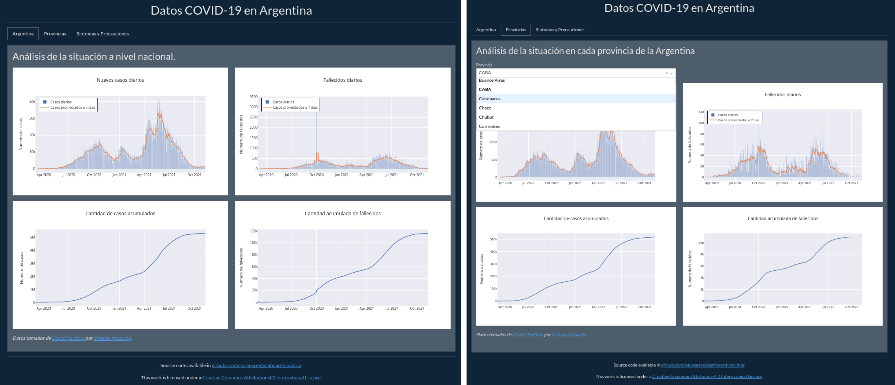

# Dashboad con los datos de COVID-19 de Argentina | Dashboard for Argentina COVID-19 data

Código fuente del dashboard fue escrito en Python usando plotly Dash y un .css
de Bootstrap.

Anteriormente, usaba Heroku para desplegar el dashboard, pero debido a un
cambio de sus términos y condiciones ya no uso el servicio.

---

Sources code for the dashboard based on plotly Dash, written in Python and
including layout customisations with .css Bootstrap.

Previously, I used to deploy the dashboard using Heroku, but due to a change of
its terms and conditions, I no longer use the service.



## Dependencias / Dependencies

- pip
- pandas
- plotly
- dash
- ipywidgets
- gunicorn
- dash-bootstrap-components

## Como desplegar el dashboard en su PC local / How to deploy the dashbor in your local CP

Si ya tiene instalado Anaconda o Miniconda, puede omitir este paso.
De lo contrario, siga las instrucciones para poner en funcionamiento Anaconda
en su sistema:
[https://docs.anaconda.com/anaconda/install/](https://docs.anaconda.com/anaconda/install/)

Ahora puede instalar todas las dependencias a través del administrador de
paquetes conda:
```
conda env crear -f environment.yml
```

Y luego activar el entorno:
```
conda activate interactive
```

Puede usar el archivo Makefile para crear y servir el dashboard:
```
make server
```
El dashboard se abrirá en su navegador predeterminado.

---

If you already have Anaconda or Miniconda installed, you can skip this step.
If not, please follow the instructions for getting Anaconda up and running in
your system:
[https://docs.anaconda.com/anaconda/install/](https://docs.anaconda.com/anaconda/install/)


Now you could install all the dependencies through the conda package manager:
```
conda env create -f environment.yml
```

And then activate the environment:
```
conda activate interactive
```

You can use the Makefile to build and server the dashboard:
```
make server
```
The dashboard will be open in your default browser.


## Fuente de datos / Data source

Los datos utilizados para graficar fueron obtenidos de repositorio
[Covid19arData](https://github.com/SistemasMapache/Covid19arData) recolectados
por [Sistema Mapache](https://smapache.com.ar/es/).

---

The data used to plot was obtained from the
[Covid19arData repository](https://github.com/SistemasMapache/Covid19arData)
collected by [Mapache System](https://smapache.com.ar/es/).


## Licencia / License

El dashboard y el script para crearlo están bajo licencia
[Creative Commons Attribution 4.0 International License][cc-by].

---

The dashboard and the code are under license
[Creative Commons Attribution 4.0 International License] [cc-by].

[![CC BY 4.0][cc-by-image]][cc-by]

[cc-by]: http://creativecommons.org/licenses/by/4.0/
[cc-by-image]: https://i.creativecommons.org/l/by/4.0/88x31.png
